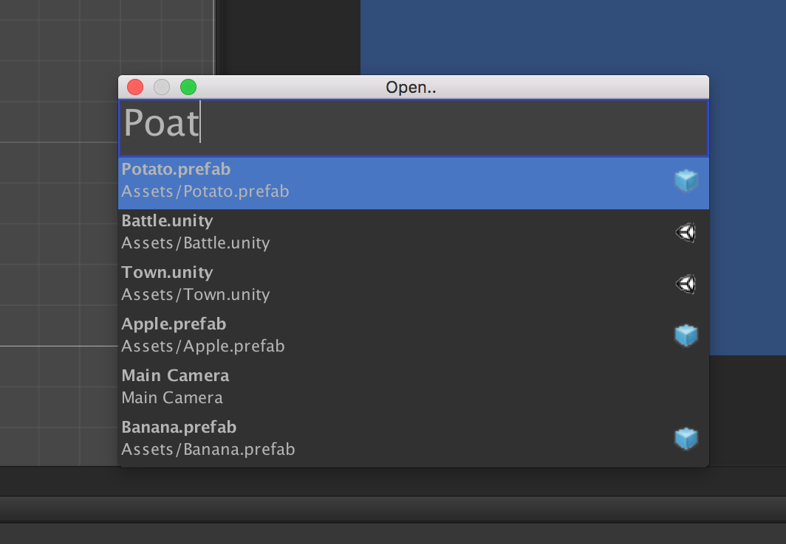
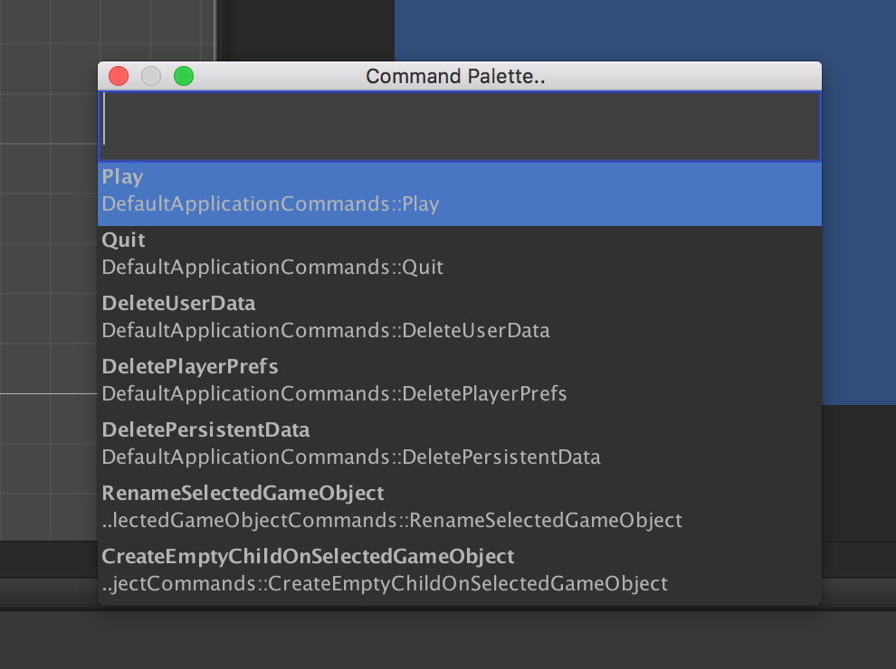

# DTCommandPalette
Command palette for Unity - run methods, open scenes, and more!

### To install:
Clone the git repository and add it to your Unity project.

### Supported Versions:
Tested on Unity 5.4. It will probably work on other similar versions..

### Features:
Open..

`%t (Cmd-T on Mac / Control-T on Windows)`
* Open Scenes
* Select GameObjects in the Scene
* Open Prefabs (requires [PrefabSandbox](https://github.com/DarrenTsung/DTCoreModule))

Command Palette

`%#m (Cmd-Shift-M on Mac / Control-Shift-M on Windows)`
* Run commands (any method with [MethodCommand] attribute can be run)

### Known Issues:
* Doesn't match Unity-Free skin
