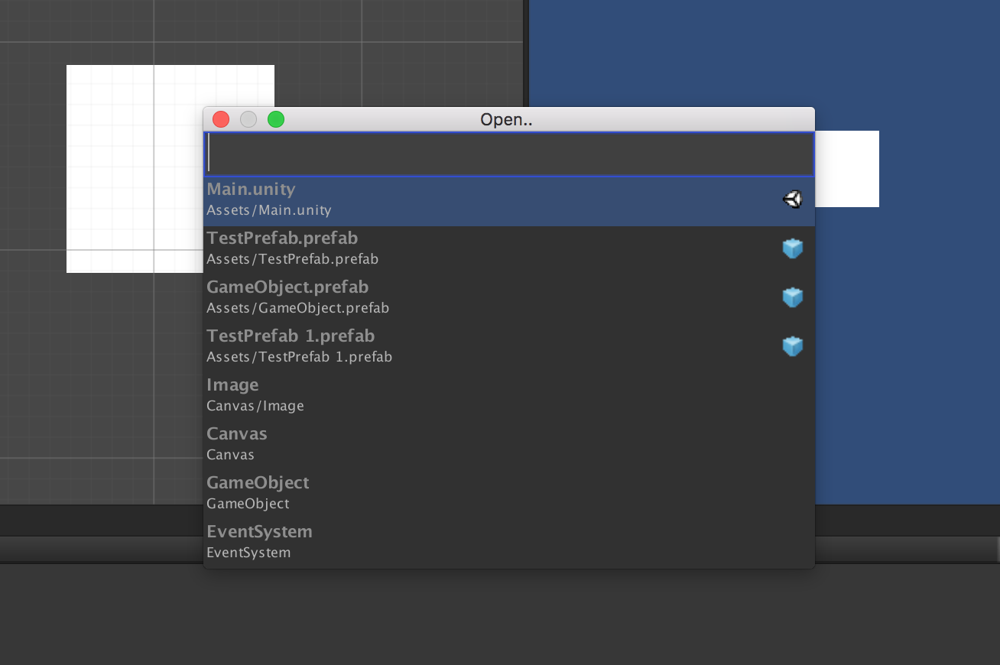

# DTCommandPalette
Command palette for Unity - run methods, open scenes, and more!

### To install:
Clone the git repository and add the entire folder to your Unity project.

### Supported Versions:
Tested on Unity 5.4. It will probably work on other similar versions..

### Features:
Open..

`%t (Cmd-T on Mac / Control-T on Windows)`
* Open Scenes
* Select GameObjects in the Scene
* Open Prefabs into a sandbox scene (requires [PrefabSandbox](https://github.com/DarrenTsung/DTPrefabSandbox))



Command Palette

`%#m (Cmd-Shift-M on Mac / Control-Shift-M on Windows)`
* Run commands (any method with [MethodCommand] attribute can be run)


Example (C#):
```csharp
using DTCommandPalette;
using UnityEngine;

public static class ExampleClass {
  [MethodCommand]
  public static void DeletePlayerPrefs() {
    PlayerPrefs.DeleteAll();
  }
}

public class ExampleMonoBehaviour : MonoBehaviour {
  [SerializeField] private Image _image;

  // This method command will only appear if
  // the currently selected GameObject has an
  // ExampleMonoBehaviour on it
  [MethodCommand]
  public void TurnYellow() {
    _image.color = Color.yellow;
  }
}
```

### Extending CommandPalette and Dependencies
To help external developers with extending CommandPalette by writing their own specific ICommands, DTCommandPalette injects a compile flag named DT_COMMAND_PALETTE into your project automatically that you can use to wrap your extension classes.

This means that you can write your code and have it be a soft (optional) dependency on DTCommandPalette instead of requiring DTCommandPalette to be imported into the project.

Example (C#):
```csharp
using UnityEngine;

#if DT_COMMAND_PALETTE
using DTCommandPalette;
#endif

public static class ExampleClass {
  #if DT_COMMAND_PALETTE
  [MethodCommand]
  #endif
  public static void DeletePlayerPrefs() {
    PlayerPrefs.DeleteAll();
  }
}
```
